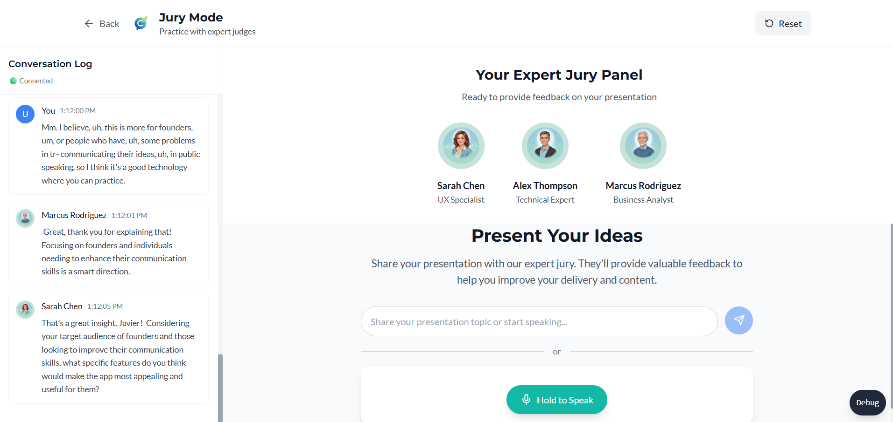
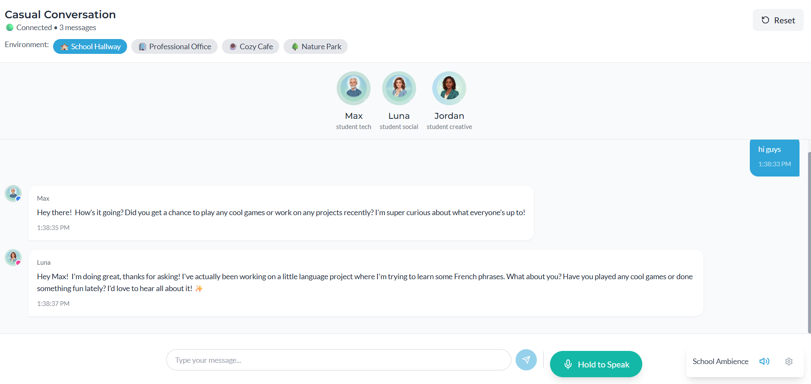
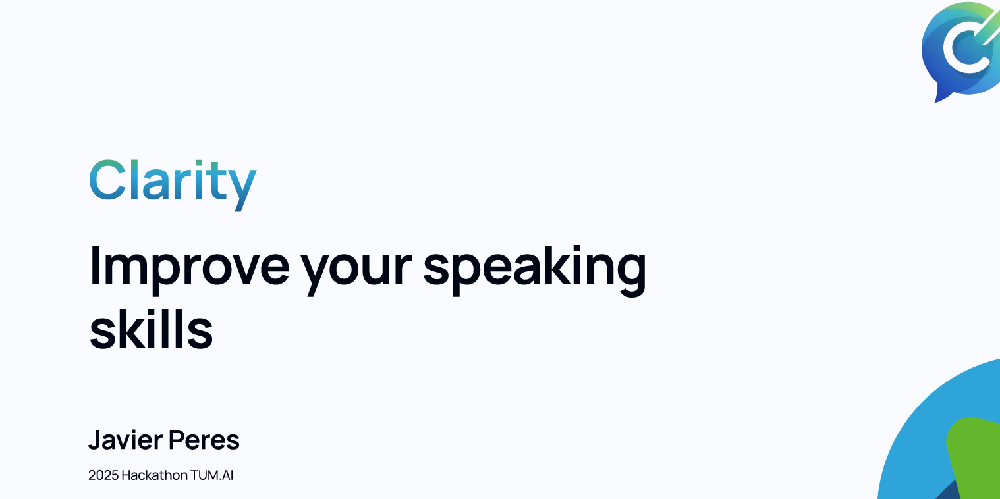

# Clarity - AI-Powered Conversational Learning Platform

> **Note**: I apologize for some aspects of the code/architecture - I understand there are better ways to implement certain features, and there are many hardcoded parts, but this was necessary due to the time constraints of showcasing a working demo for the hackathon!

## 🎥 Demo Videos

### Main Demo

[](https://www.loom.com/share/bc54422e8bc54650bc559e3059dac105?sid=ed7a698d-20a5-4030-9c06-6eada902c1ab)

_Click to watch the full demo_

### Conversation Mode Demo

[](https://www.loom.com/share/8533741e3af145ad84af6c8a560060ec?sid=841e1c99-aa4b-46b1-9be3-08a8f81004a6)

_See Clarity's conversational learning in action_

## 📊 Presentation

[](https://www.loom.com/share/8171c0be440647d3861c21b339cf8bac?sid=4b65da40-37ec-4f62-a183-df4b5d4be9fe)

_View our hackathon presentation_

### Alternative Links

- [Figma Presentation Deck](https://www.figma.com/deck/EdLgcV41ZVdtp1TzYb8JKO/hackthon-Presentation?node-id=1-38&t=sPRHiW6z6zOCGqzf-1&scaling=min-zoom&content-scaling=fixed&page-id=0%3A1)
- [Video Presentation](https://www.loom.com/share/8171c0be440647d3861c21b339cf8bac?sid=4b65da40-37ec-4f62-a183-df4b5d4be9fe)

## 🌐 First Frontend design with lovable

Check here: [https://preview--clarity-talk-studio.lovable.app/](https://preview--clarity-talk-studio.lovable.app/)

## 🚀 What is Clarity?

Clarity is an AI-powered immersive learning app designed to solve a critical problem: brilliant technical minds and entrepreneurs often struggle to clearly express their ideas or sell their vision. Too many great projects go unnoticed, not because they lack potential, but because the founders couldn't communicate them effectively.

**Our mission**: Improve your confidence, with Clarity.

## 🎯 How It Works

Clarity creates realistic environments where users can engage in dynamic conversations with multiple AI agents. These agents don't just respond - they interact with each other, creating natural and immersive discussions that adapt to your needs.

### 🗣️ Three Main Modes

1. **Conversational Mode**

   - Practice languages in real-life scenarios (school, workplace, travel, interviews)
   - AI agents adapt to your skill level
   - Immersive background sounds enhance the experience
   - Natural group conversations with multiple agents

2. **Presentation Jury Mode**

   - Rehearse pitches and public speaking with AI juries
   - Receive tough questions and structured feedback
   - Build confidence for real presentations
   - Expert feedback from Technical, UX, and Business specialists

3. **Create a Scene Mode** _(Coming Soon)_
   - Design custom scenarios with personalized agents
   - Flexible setups for any situation
   - Prepare for business meetings, startup demo days, and more

## 🏗️ Technical Architecture

### Frontend

- **Built with**: [Lovable](https://lovable.dev) for rapid prototyping
- **Framework**: React 18 + TypeScript
- **Styling**: Tailwind CSS with custom brand colors
- **Real-time**: WebSocket connections for live conversations
- **Audio**: ElevenLabs integration for speech-to-text and text-to-speech

### Backend

- **Orchestration**: Powered by [Autogen](https://microsoft.github.io/autogen/) for multi-agent conversations
- **API**: FastAPI with WebSocket support
- **AI Models**: OpenAI GPT-4o-mini for agent intelligence
- **Voice**: ElevenLabs for natural, human-like voices
- **Memory**: Persistent conversation context across sessions

### Development Workflow

- **AI Assistant**: [Claude](https://claude.ai) for code generation and architecture
- **Frontend Development**: [Lovable](https://lovable.dev) for rapid UI development
- **Agent Orchestration**: [Autogen](https://microsoft.github.io/autogen/) for multi-agent coordination

## 🎨 Key Features

- **Multi-Agent Conversations**: Natural interactions between multiple AI personalities
- **Voice Integration**: Record your speech and hear agent responses
- **Visual Avatars**: Gender-based avatar system with speaking indicators
- **Background Audio**: Immersive environment sounds
- **Real-time Streaming**: Live conversation flow via WebSockets
- **Persistent Memory**: Agents remember conversation context
- **Natural Turn-Taking**: Realistic delays between responses

## 🚀 Quick Start

### Prerequisites

- Node.js 18+
- Python 3.8+
- ElevenLabs API key
- OpenAI API key

### Installation

1. **Clone the repository**

```bash
git clone <repository-url>
cd clarity-app
```

2. **Backend Setup**

```bash
cd backend
python -m venv venv
source venv/bin/activate  # Windows: venv\Scripts\activate
pip install -r requirements.txt

# Copy .env file and add your API keys
cp .env.example .env
# Edit .env with your OPENAI_API_KEY and ELEVENLABS_API_KEY
```

3. **Frontend Setup**

```bash
cd ../frontend
npm install
```

4. **Start the Application**

```bash
# Terminal 1 - Backend
cd backend
python app.py

# Terminal 2 - Frontend
cd frontend
npm run dev
```

Visit http://localhost:3000 to start using Clarity!

## 📁 Project Structure

```
clarity-app/
├── backend/
│   ├── app.py                    # FastAPI main application
│   ├── agents/templates.py       # AI agent configurations
│   ├── services/
│   │   ├── autogen_service.py    # Multi-agent orchestration
│   │   └── conversation_service.py # Conversation management
│   ├── models/schema.py          # Data models
│   └── requirements.txt          # Python dependencies
├── frontend/
│   ├── src/
│   │   ├── components/           # React components
│   │   ├── services/             # API and audio services
│   │   ├── types/                # TypeScript definitions
│   │   └── utils/                # Helper functions
│   ├── public/avatars/           # Avatar images
│   └── package.json              # Frontend dependencies
└── README.md
```

## 🎭 Agent Personalities

### Presentation Jury Mode

- **Sarah Chen** - UX Specialist focused on user experience
- **Alex Thompson** - Technical Expert for implementation questions
- **Marcus Rodriguez** - Business Analyst for market viability

### Environment Mode

- **Max** - Tech-savvy high school student
- **Luna** - Social and encouraging student
- **Jordan** - Creative and artistic student

## 🌟 Hackathon Project

This project was developed for the **Anthropic Hackathon - CDTM TUM.AI Munich 2025**.

Built with ❤️ in Munich during an intensive hackathon sprint, focusing on practical solutions for real communication challenges faced by entrepreneurs and language learners.

## 👥 Team

**Javier** - Full-stack development, AI orchestration, and product vision

_Special thanks to the tools that made rapid development possible: Lovable for frontend development, Claude for AI-assisted coding, and Autogen for multi-agent conversations._

## 📄 License

MIT License

Copyright (c) 2025 Clarity Team

Permission is hereby granted, free of charge, to any person obtaining a copy
of this software and associated documentation files (the "Software"), to deal
in the Software without restriction, including without limitation the rights
to use, copy, modify, merge, publish, distribute, sublicense, and/or sell
copies of the Software, and to permit persons to whom the Software is
furnished to do so, subject to the following conditions:

The above copyright notice and this permission notice shall be included in all
copies or substantial portions of the Software.

THE SOFTWARE IS PROVIDED "AS IS", WITHOUT WARRANTY OF ANY KIND, EXPRESS OR
IMPLIED, INCLUDING BUT NOT LIMITED TO THE WARRANTIES OF MERCHANTABILITY,
FITNESS FOR A PARTICULAR PURPOSE AND NONINFRINGEMENT. IN NO EVENT SHALL THE
AUTHORS OR COPYRIGHT HOLDERS BE LIABLE FOR ANY CLAIM, DAMAGES OR OTHER
LIABILITY, WHETHER IN AN ACTION OF CONTRACT, TORT OR OTHERWISE, ARISING FROM,
OUT OF OR IN CONNECTION WITH THE SOFTWARE OR THE USE OR OTHER DEALINGS IN THE
SOFTWARE.

## 🔗 Resources

- [Autogen Documentation](https://microsoft.github.io/autogen/)
- [ElevenLabs API](https://elevenlabs.io/docs)
- [FastAPI Documentation](https://fastapi.tiangolo.com/)
- [React Documentation](https://react.dev/)

---

**Improve your confidence, with Clarity** 🚀
